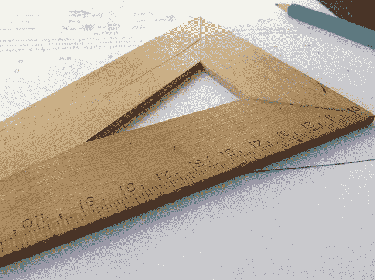

<!--yml
category: 微服务
date: 2022-11-19 13:25:35
-->

# 系统设计面试指南一（zthinker）

> 来源：[https://zthinker.com/archives/8-things-you-need-to-know-before-system-design-interviews](https://zthinker.com/archives/8-things-you-need-to-know-before-system-design-interviews)

1.  [Java内存管理面试指南一](https://zthinker.com/archives/java-memory-interview-1)
2.  [Java基础面试指南一](https://zthinker.com/archives/java-basic-interview-1)
3.  [Java基础面试指南二](https://zthinker.com/archives/java-basic-interview-2)
4.  [Java基础面试指南三](https://zthinker.com/archives/java-basic-interview-3)
5.  [Java基础面试指南四](https://zthinker.com/archives/java-basic-interview-4)
6.  [Java线程面试指南一](https://zthinker.com/archives/java-thread-interview-1)
7.  [Java线程面试指南二](https://zthinker.com/archives/java-thread-interview-2)
8.  [Redis面试指南一](https://zthinker.com/archives/redis-interview-1)
9.  [Kafka面试指南一](https://zthinker.com/archives/kafka-interview-1)
10.  [Spring面试指南一](https://zthinker.com/archives/spring-interview-1)
11.  [SpringBoot面试指南一](https://zthinker.com/archives/springboot-interview-1)
12.  [微服务面试指南一](https://zthinker.com/archives/microservice-interview-1)
13.  [系统设计面试指南一](https://zthinker.com/archives/8-things-you-need-to-know-before-system-design-interviews)

关于面试准备最常见的问题是什么?我可以立即告诉:如何准备系统设计面试?

许多人担心系统设计面试,因为没有一定的准备方式,而且这个问题非常灵活且不可预测。而且,系统设计问题通常是开放式的,因此没有标准或正确的答案,这使得准备过程更加困难。

在**过去的一个月中**,我们一直在本指南中告诉您在进行系统设计面试之前最好了解的事情,同时让您更加轻松自如,因为系统设计面试并不像许多人认为的那么难绝对可以帮助您擅长的方法。

## **1.在系统设计面试中要评估什么?**

众所周知,编码面试的重点是候选人的基本知识,因此测试了他的一般技术技能,分析能力。

但是,很少有人能清楚地说明进行系统设计访谈的目的。因此,在进入技巧之前,最好从访问者的角度了解系统设计访问。

在系统设计面试中,通常会要求应聘者设计一个新系统,以解决诸如设计URL缩短服务之类的开放性问题。有时问题可能很普遍,例如您如何为Youtube设计推荐的系统。

在此过程中,讨论是核心。候选人更有可能领导面试官与对话和讨论的高层要素,细节,利弊以及所有事物。

与编码面试相比,系统设计面试与软件工程师的日常工作非常相似。

在面试过程中,主要评估您的沟通和解决问题的能力。给定一个悬而未决的问题,如何分析问题,如何逐步解决问题,如何解释想法并与他人讨论,如何评估系统和优化系统是面试官最关心的问题。

因此,让我们看看您可以为此做些什么。

## **2.提前练习**

准备系统设计面试的最佳方法始终是通过实际的项目和实践。许多人很早就开始准备过程,例如提前6个月或1年,这绝对是您的最佳实践。

我们看到的一个常见模式是,您拥有的实践经验越多,您在系统设计面试中的表现就越好。这很容易理解,因为这些系统设计问题全部来自现实生活中的产品,以前曾在许多项目上工作过的人往往对这些问题有更好的认识,或者这只是他们以前解决的问题之一。

当被要求设计Youtube推荐系统时,它与许多其他的推荐系统类似,即Amazon的系统,因为这里有很多概念。

如果您有推荐方面的经验,或者您已经阅读过某些文章/书或对此有所考虑,那么您至少必须能够提出一些初步的想法。

如果您不知道要做什么,可以为您提供一些建议:

*   建立小型服务/产品以解决您遇到的实际问题
*   为Github上的开源项目做贡献
*   找到您喜欢的机器学习,网络等感兴趣的主题,并搜索一些您可以从事的项目

真正重要的是动手做一些现实生活中的项目。您可能需要花很长时间才能看到自己的进步,但是到那时,您会注意到这些面试问题有多简单。此外,从长远来看,您将从中受益匪浅。

## **3.熟悉基础知识**

我不记得我曾强调过多少次,但这对于系统设计面试非常重要。由于系统设计问题是开放式的,并且可能涉及许多技术领域,因此这里的基本知识不仅仅是数据结构和算法。

首先,毫无疑问,您应该非常擅长数据结构和算法。以URL缩短服务为例,如果您不清楚哈希,时间/空间复杂度分析,将无法提出一个好的解决方案。

通常,时间和内存效率之间需要权衡取舍,并且您必须非常精通big-O分析才能弄清所有内容。

您最好还熟悉其他几件事,尽管您的面试中可能没有涉及到它们。

*   抽象。对于系统设计面试来说,这是一个非常重要的话题。您应该清楚如何抽象一个系统,在其他组件中可见和不可见的内容以及其背后的逻辑是什么。面向对象的编程也很重要。
*   数据库。您应该清楚那些基本概念,例如关系数据库。对No-SQL的了解可能取决于您的水平(新毕业生或经验丰富的工程师)。
*   网络。您应该能够清楚地解释在浏览器中键入“zthinker.com”时发生的情况,例如DNS查找,HTTP请求之类的内容应该清楚。
*   并发。如果您可以识别系统中的并发问题并告诉访问者如何解决它,那将是很好的。有时,这个主题可能很难,但是了解诸如竞态条件,死锁之类的基本概念是最重要的。
*   操作系统。有时,您与面试官的讨论可能会进行得很深入,此时最好了解底层操作系统的工作方式。
*   机器学习(可选)。您不需要成为专家,但是再次熟悉一些基本概念,例如特征选择,ML算法的总体工作方式。

请记住,这里的要点是要求您从头开始学习所有这些知识,这可能需要一年多的时间。真正重要的是每个主题背后的基本概念。例如,如果您不能在面试中实现神经网络,那是完全可以的,但是您应该能够在句子中进行解释。

## **4.自顶向下+模块化**

这是解决系统设计问题和向面试官解释的一般策略。最坏的情况总是总是立即跳入细节,这只会使事情变得一团糟。

取而代之的是,最好先从高层次的想法开始,然后逐步找出细节,所以这应该是自上而下的方法。为什么?因为许多系统设计问题都是非常笼统的问题,没有大图就无法解决。

让我们以Youtube推荐系统为例。我可能首先将其分为前端和后端(面试官可能只要求后端或特定部分,但我将介绍整个系统以给您一个想法)。对于后端,流程可以分为3个步骤:收集用户数据(例如他观看的视频,位置,偏好等),生成推荐的离线管道,以及将数据存储并提供给前端。然后,我们可以跳入每个详细的组件。

对于用户数据,我们可以列出我们认为与用户可能喜欢的视频相关的功能。对于管道,我们可以讨论如何训练数据集等。我们可以更深入。由于Youtube具有庞大的数据集,因此脱机管道必须运行在大量数据上,然后可以使用MapReduce或Hadoop。

我们可以通过做得越来越深入来无限地继续进行此分析,但是我想在这里解释的想法是,您应该始终拥有一幅大图。

这里的另一个技巧是模块化。就像我上面说明的那样,最好将系统分为不同的组件,这也是现实项目中的一个好习惯。模块化不仅可以使您自己和访问者的设计更加清晰,而且可以使测试变得更加容易。

## **5.利与弊**

系统设计问题通常没有太多限制。结果,好的解决方案和坏的解决方案之间没有明确的界限。在这种情况下,您有责任了解不同情况下的最佳方法。

最常见的折衷是在时间和内存之间。您可以直接将每个解决方案的优缺点告诉面试官,并请他澄清一些限制,例如您拥有多少内存。

同样,当被要求优化系统时,您还可以在其中放置几个​​常见的约束,例如,如果您正在为驾照设计一些东西,您可以告诉面试官合理的假设是,驾照号码的最大长度可能是7,并且这样,您便可以将所有许可证存储在内存中,从而可以进一步优化系统。

## **6.估算**

在进行估算时,最好具有良好的数字意识,这在实际项目中尤为重要。更具体地说,您应该对系统或程序将导致多少内存,其运行速度以及基于估计的设计调整方式有一个清晰的估计。

当然,如果我们使用驾驶执照示例,您可以说我们假设内存足以在美国存储所有驾照。但是,首先估计要存储它们的内存量会给人留下深刻的印象。

要估算内存成本,如果最大长度为7,则应该计算出多少个许可证,以及将用于存储什么数据结构,然后弄清楚所需的内存量,这将使您清楚地知道该方法是可行的。

同样,在决定存储时,内存当然不是唯一的解决方案。除了将所有内容存储在内存中之外,您还可以存储在磁盘中,也可以存储在多台计算机中。选择最佳方法实际上是估算时间和存储成本的问题。弄清执行时间和内存限制的瓶颈,将使您更加清楚地了解整个系统。

## **7.模拟面试**

坦白地说,要自己进行系统设计面试并不容易,因为没有标准的答案。因此,建议总是在一些经验丰富的工程师面前进行。

同样,在此过程中,您将花费大部分时间与访问者进行交流和讨论,而这正是系统设计访问的主要内容。因此,简而言之,我们强烈建议您与其他人一起练习系统设计面试,而不要一个人练习。

像[Gainlo](http://www.gainlo.co/?utm_source=blog&utm_medium=8%20Things%20You%20Need%20to%20Know%20Before%20a%20System%20Design%20Interview&utm_campaign=blog) 这样的网站使您可以对来自Google,Amazon等的员工进行模拟面试,这可能会很有帮助。

## **8.向现有系统学习**

我通常建议人们这样做。每当您对某个系统感到好奇时,请尝试弄清楚该系统是如何设计的。您可以先尝试自己设计,然后再与实际设计进行比较。最重要的是,尝试了解为什么以这种方式设计它。某些约束很可能迫使系统像这样,例如数据大小,速度要求等。

[http://highscalability.com](http://highscalability.com) 上有很多有关如何设计现实世界系统的好文章。对于系统设计面试来说可能有点过头了,但是了解它们总是一件好事。

您还会注意到,即使对于相同类型的系统,不同的公司可能也具有完全不同的设计方式。通过探索,您一定会学到很多东西。

## **结论**

进行系统设计面试非常有趣,因为它离实际产品更近。准备的关键是要清楚面试中的预期,并花足够的时间和精力在真正重要的事情上。

如果您担心系统设计问题没有标准答案,那么您也可以将其视为正确的答案。

我希望这篇文章能使您减少对系统设计面试的忧虑,并让我知道您对此有何想法。